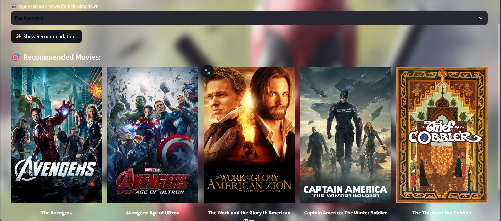
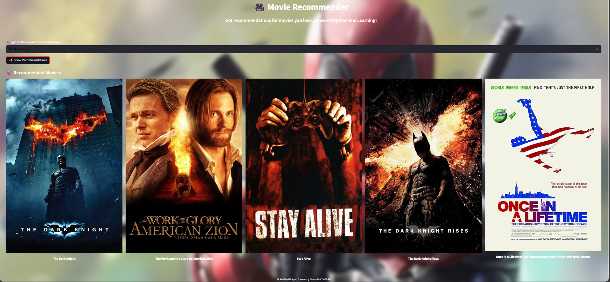

# 🎥 Movie Recommender System

A **Content-Based Movie Recommendation System** built with **Python, NLP, and Streamlit**.  
This system suggests movies similar to the one you select, based on their **tags** (overview, genre, keywords, cast, crew).  

---

## 🔹 Features
- ✅ Recommends **Top 5 Similar Movies** to the selected one  
- ✅ Uses **CountVectorizer + Cosine Similarity** for recommendations  
- ✅ Interactive **Streamlit Web App**  
- ✅ Clean and Simple UI  
- ✅ Deployable on **Streamlit Cloud**  

---

## 🔹 Tech Stack
- **Python**
- **Pandas / NumPy**
- **scikit-learn** (CountVectorizer, Cosine Similarity)
- **Streamlit** (for UI)
- **Requests** (for fetching posters from TMDB API)

---

## 🔹 Dataset
The dataset used in this project is included in this repository as **`Dataset.zip`**.  
It contains details like **genres, keywords, cast, crew, and overview** of movies.  

👉 **Before running the project**, make sure to extract the contents of `Dataset.zip`.  
The extracted folder includes files like:
- `tmdb_5000_movies.csv`  
- `tmdb_5000_credits.csv`

---

## 🔹 Demo  

<p float="left">
  
  
</p>

---

## 🔹 Installation & Usage

1. **Clone this repository**:
   ```bash
   git clone https://github.com/nilotpaldhar2004/movie-recommender-system.git
   cd movie-recommender-system
